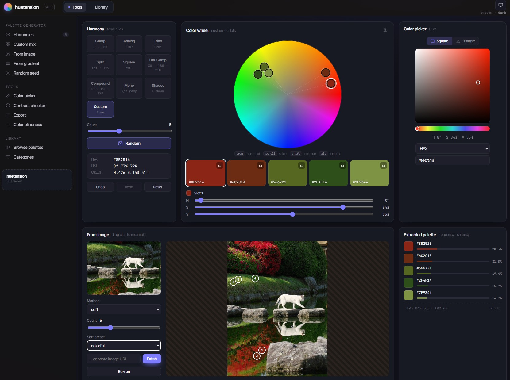

# huetension

A color palette toolkit for designers, frontend devs, and photographers. One binary, three frontends — **CLI**, **MCP server**, and **Web UI** — sharing a single pure-Go core.

[](https://goreportcard.com/report/github.com/leporel/huetension)
[](https://pkg.go.dev/github.com/leporel/huetension)
[](https://github.com/leporel/huetension/releases)
[](LICENSE)
[](https://github.com/leporel/huetension/issues)
[](https://github.com/leporel/huetension/actions/workflows/ci.yml)



## Features

### 🎨 Palette generation

-  **Extract from images** — file path, http(s) URL, `data:` URI, or stdin. Methods: `soft` (default, designer-friendly), `softk`, `kmeans`, `okkmeans`, `mediancut`, `octree`, `popularity`, `wu`, `dbscan`, `wkmeans`, with mood presets for `soft`/`softk`.
-  **Random palettes** — deterministic when seeded, optionally driven by a harmony rule.
-  **Harmonies around a base color** — complementary, analogous, triadic, split, tetradic, square, double-complementary, compound, monochromatic, shades.
-  **Gradients** — two endpoints or N positioned stops, interpolated in OkLab / OkLCH / Lab / RGB / HSL with optional easing.
-  **Interactive color wheel** (web UI) — drag handles to mix custom palettes, pin the card while editing.

### 🔍 Analysis

-  **Contrast scoring** — WCAG 2.1 and APCA side-by-side. Foreground "analyse" mode (`--suggest`) finds the nearest passing OkLCH lightness for a failing fg / bg pair.
-  **Color-vision-deficiency simulation** — protanopia, deuteranopia, tritanopia, achromatopsia. Live preview in the SPA.
-  **Image color-distribution strips** by color space and distance metric (`analyze`).

### 🛠️ Color utilities

-  **Convert** between hex / RGB / HSL / HSV / HLS / Lab / LCH / OkLab / OkLCH / CSS named / 24-bit integer.
-  **Sort lists** by luminance, lightness, OkLab L, hue, saturation, or frequency.

### 🎬 3D LUT

-  **`.cube` LUT** — palette-driven, two grading methods: **Smooth** (RBF over OkLab) or **Layered** (K-NN over OkLCH).
-  **LUT Texture PNG** — the cube laid out as a 2D image, handy for OBS-style real-time color grading and other tools that accept a texture LUT.
-  **In-browser preview** on your own image — the backend pipes the `.cube` text into ffmpeg's `lut3d` filter, so `ffmpeg` must be on the server's `PATH`.

### 📚 Library

-  **Bundled curated catalogue** ships in the binary.
-  **Save your own palettes** to `library.json` from the CLI, the REST API, or the MCP `library.save` tool — they join the `Saved` category alongside the defaults.

### 📤 Export

-  JSON, plain TXT, CSS custom properties, SCSS, LESS, Tailwind `theme.extend.colors`, GIMP `.gpl`, GIMP `.ggr` (gradient), SVG, PNG, JPEG, Adobe `.ase`, Adobe `.aco`.

## Three modes

### CLI

```sh
huetension extract photo.jpg -k 6
huetension harmony complementary "#3498db"
huetension gradient "#ff0066" "#00bcd4" --steps 9
huetension contrast "#222" "#fff" --algo wcag21
```

ANSI swatches by default, JSON / CSS / SCSS / Tailwind / GIMP `.gpl` / PNG / `.ase` / `.aco` on demand.

### MCP server

```sh
huetension mcp --transport stdio
```

15 default-enabled tools (`color.convert`, `harmony.generate`, `image.extract`, `library.list`, …) speaking the same JSON contract as the CLI. Drop into Claude Desktop, an editor, or any MCP client:

```json
{
  "mcpServers": {
    "huetension": {
      "command": "huetension",
      "args": ["mcp", "--transport", "stdio"]
    }
  }
}
```

### Web UI

```sh
huetension web                       # http://127.0.0.1:8080
```

The embedded Vue SPA — color wheel, harmonies, image extraction, contrast / blindness checks, library, palette-driven 3D LUTs. Same REST envelope as `huetension --format json`.

## Install

### `go install`

```sh
go install github.com/leporel/huetension/cmd/huetension@latest
```

Requires Go ≥ 1.26. The SPA assets are committed under `web/dist/` and embedded into the binary, so this produces a fully functional Web UI without `bun`.

### Pre-built archives

Pick the right archive from the [latest release](https://github.com/leporel/huetension/releases/latest):

| OS | Arch | File |
| --- | --- | --- |
| Linux | amd64 | `huetension_<v>_linux_amd64.tar.gz` |
| Linux | arm64 | `huetension_<v>_linux_arm64.tar.gz` |
| macOS | amd64 | `huetension_<v>_darwin_amd64.tar.gz` |
| macOS | arm64 | `huetension_<v>_darwin_arm64.tar.gz` |
| Windows | amd64 | `huetension_<v>_windows_amd64.zip` |
| Windows | arm64 | `huetension_<v>_windows_arm64.zip` |

Each archive ships the binary, `LICENSE`, `README.md`, and `huetension.example.yaml`. SHA-256 checksums are published next to the archives.

### Docker

The release image is `ghcr.io/leporel/huetension`. Three common shapes:

**Web UI + REST API** —

```sh
docker run --rm -p 8080:8080 \
  ghcr.io/leporel/huetension:latest \
  web --address 0.0.0.0:8080
```

**MCP over HTTP** —

```sh
docker run --rm -p 7337:7337 \
  -v "$HOME/.config/huetension:/data:ro" \
  ghcr.io/leporel/huetension:latest \
  mcp --transport http --address 0.0.0.0:7337 \
      --auth-token "$TOKEN" --data-dir /data
```

**Web + MCP on the same port (`serve`)** —

```sh
docker run --rm -p 8080:8080 \
  -v "$HOME/.config/huetension:/data:ro" \
  ghcr.io/leporel/huetension:latest \
  serve --address 0.0.0.0:8080 \
        --auth-token "$TOKEN" --data-dir /data
```

The SPA is served at `/`, the REST API mounts under `/api/v1`, and the MCP HTTP transport mounts under `/mcp`. Add `--mcp-transport http,sse` to also expose SSE at `/mcp/sse`.

For MCP-over-stdio inside Docker (Claude Desktop and similar), see [`docs/mcp.md`](docs/mcp.md).

### From source

```sh
git clone https://github.com/leporel/huetension
cd huetension/web && bun install --frozen-lockfile && bun run build
cd .. && go build ./cmd/huetension
```

Build order matters: the SPA assets are embedded, so `bun run build` must run before `go build`.

## CLI quick reference

| Command | What it does |
| --- | --- |
| `extract <source>` | Pull a palette from an image (file / URL / data: / stdin). |
| `analyze <source>` | Image color-distribution strips by color space + distance metric. |
| `harmony <type> <color>` | Generate a harmony around a base color. |
| `gradient` | Two-endpoint or N-stop gradients with easing. |
| `contrast` | WCAG 2.1 / APCA contrast scores. |
| `blindness` | Simulate protanopia / deuteranopia / tritanopia / achromatopsia. |
| `convert` / `sort` | Color-list utilities; read stdin when no args. |
| `random` | Generate a random palette, optionally harmonised. |
| `css` / `tailwind` | Export-only conveniences. |
| `lut` | Palette-driven 3D LUT (`.cube`) — RBF or K-NN grading. |
| `library` / `library add` | Manage the on-disk palette catalogue. |
| `mcp` / `web` / `serve` | Long-running servers (see below). |
| `version` / `completion` | Print version, generate shell completions. |

Full reference in [`docs/cli.md`](docs/cli.md). Every command supports `--help`.

## MCP usage

`huetension mcp` runs the MCP server over **stdio** (default; for Claude Desktop / editors), **http** (recommended for remote use), or **sse** (legacy). The same `mcp:` section of `config.yaml` controls which tools are exposed, and is also honoured by `huetension serve`.

Tool catalogue, transport details, image-sandbox flags, and container configs live in [`docs/mcp.md`](docs/mcp.md).

## Web UI tour

Tools page (the default route):

- **Color wheel** — drag handles to mix custom palettes; pin the card to keep it visible while scrolling.
- **Harmonies / Random / Gradient** — generate around a base color or a seed.
- **From image** — drag-drop or paste an image; choose extract method + size.
- **Contrast checker** — WCAG / APCA side-by-side.
- **Color blindness** — preview palettes under each CVD type.
- **Export** — JSON / CSS / SCSS / LESS / Tailwind / GIMP `.gpl` / PNG / SVG / `.ase` / `.aco`. Includes a palette-driven 3D LUT tab with in-browser grading preview.

Library page (`/library`):

- Browse the bundled curated catalogue and any palettes you've saved.

## Configuration

`config.yaml` lives in the data directory — `~/.config/huetension/` on Linux/macOS, `%APPDATA%\huetension\` on Windows. Override with `--data-dir` or `HUETENSION_DATA_DIR`.

```yaml
# Blacklist — start from the default-enabled set, remove specific tools.
mcp:
  disable:
    - image.extract
    - library.save
```

```yaml
# Whitelist — expose ONLY these tools; everything else is off.
mcp:
  enable:
    - color.convert
    - harmony.generate
    - contrast.check
```

Precedence: flag > `HUETENSION_*` env > `config.yaml` > built-in default.

Full reference in [`docs/config.md`](docs/config.md); annotated example at [`huetension.example.yaml`](huetension.example.yaml).

## Library

The data directory also holds `library.json`. Bundled palettes ship with the binary; saved palettes (via `huetension library add`, POST `/api/v1/library`, or the MCP `library.save` tool) are appended under the `Saved` category.

```json
{
  "version": 1,
  "palettes": [
    {
      "id": "brand-minimal",
      "name": "Brand minimal",
      "source": "user",
      "categories": ["Saved"],
      "colors": [
        { "hex": "#111827", "name": "Ink" },
        { "hex": "#F9FAFB", "name": "Paper" },
        { "hex": "#2563EB", "name": "Accent" }
      ]
    }
  ]
}
```

## Development

Repo layout:

- `cmd/huetension/` — CLI entrypoint, command tree.
- `internal/color`, `internal/palette`, `internal/harmony`, `internal/gradient`, `internal/contrast`, `internal/blindness`, `internal/extract`, `internal/exporter`, `internal/imageio`, `internal/cliutil`, `internal/lut` — pure-Go core.
- `internal/web/` — REST API + embedded SPA.
- `internal/mcp/` — MCP server + tool registry.
- `internal/serve/` — combined SPA + REST + MCP listener.
- `web/` — Vue 3 SPA source; built bundle committed to `web/dist/`.
- `docs/` — long-form documentation.

Common tasks:

```sh
go test ./... -short          # fast tests (skips heavy extract sidecar)
go test ./...                 # full suite
cd web && bun run dev         # SPA dev server with HMR
huetension web --dev http://localhost:5173    # Go API in front of Vite
```

Release process: [`docs/RELEASING.md`](docs/RELEASING.md).

Extract testdata guidance: [`internal/extract/testdata/README.md`](internal/extract/testdata/README.md).

## License

MIT — see [`LICENSE`](LICENSE).

## Inspirations

Built after exploring these projects:

- [qTipTip/Pylette](https://github.com/qTipTip/Pylette) — a Python library for extracting color palettes from supplied images.
- [lazymac2x/color-palette-api](https://github.com/lazymac2x/color-palette-api) — harmonies, gradients, WCAG contrast, CSS/Tailwind. REST API.

## Acknowledgements

- [`modelcontextprotocol/go-sdk`](https://github.com/modelcontextprotocol/go-sdk) — MCP transport machinery.
- [`lucasb-eyer/go-colorful`](https://github.com/lucasb-eyer/go-colorful) — color space conversions and distance metrics.
- [`anthonynsimon/bild`](https://github.com/anthonynsimon/bild) — image decoding and processing helpers.
- [`charm.land/lipgloss`](https://charm.land/lipgloss) — terminal styling for the CLI's ANSI swatches.
- [`spf13/cobra`](https://github.com/spf13/cobra) + [`spf13/viper`](https://github.com/spf13/viper) — CLI / configuration plumbing.
