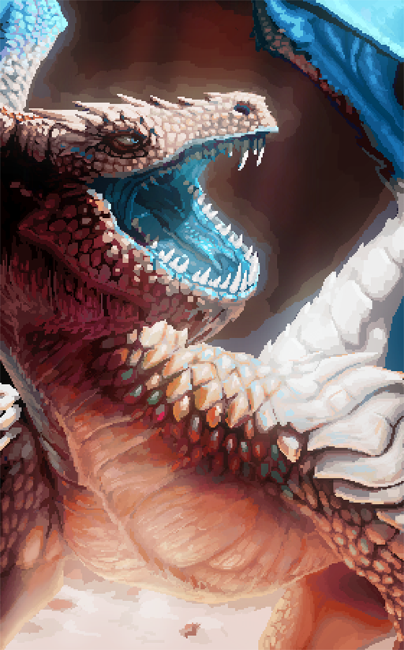

# extract testdata

All previews use `PaletteSize: 6` and `SortBy: palette.SortByOkL` so the
swatch row reads dark → light like a gradient.

## Method × source matrix

| Method | img1.png | img2.jpg | img3.jpg |
|---|---|---|---|
| **source** |  |  |  |
| `kmeans` (CIE Lab) |  |  |  |
| `okkmeans` (OkLab) |  |  |  |
| `mediancut` |  |  |  |
| `soft` (default) |  |  |  |
| `softk` |  |  |  |
| `octree` |  |  |  |
| `popularity` |  |  |  |
| `wu` |  |  |  |
| `dbscan` |  |  |  |
| `wkmeans` |  |  |  |

## Two flavours, picked by intent

**Frequency-faithful** — palette mirrors how the image is *covered*:

- `kmeans` / `okkmeans` — Lloyd-style clustering in perceptual space.
- `mediancut` — recursive RGB-cube splits along the longest axis.
- `octree` — 8-ary RGB tree, depth 8. Phase 1 collapses lowest-population
  subtrees; Phase 2 finishes with greedy nearest-pair merging in OkLab.
- `popularity` — 5-bit-per-channel histogram, top-N bins.
- `wu` — Xiaolin Wu's variance-minimising quantiser.

**Saliency-aware** — palette surfaces what the eye *notices*, including
small-but-distinctive regions:

- `soft` (default) — Lab over-clustering, ΔE merge with fixed threshold,
  population × saturation ranking. Default Epsilon = 12.0.
- `softk` — same pipeline as `soft` but with dynamic merging: clusters are
  merged greedily until `k × 1.5` remain, guaranteeing that large areas
  are reassembled instead of being fragmented and outranked. Final ranking
  still uses population × saturation.
- `dbscan` — density-based clustering in OkLab. When natural-photo gradient
  chaining merges everything into one cluster (typical), pads with
  saliency-weighted farthest-point sampling so vibrant minor colors win
  against JPEG-noise extremes on the lightness axis.
- `wkmeans` — over-clustered weighted Lloyd in OkLab, 
  ΔE-merge of perceptually-close centroids, then top-K by saliency.
  Output `Freq` still reports honest pixel coverage; saliency only drives
  ranking.

`saliency` here is the proxy `log(count + 1) × (saturationFloor + saturation)^SaliencyPow` — see `internal/extract/saliency.go` for the rationale.
It's not a real visual saliency model; that would require the original 2D pixel grid, which the extract layer deliberately flattens.

## Regenerating

```sh
go test ./internal/extract/ -run TestExtractWritesPaletteSidecar
```
